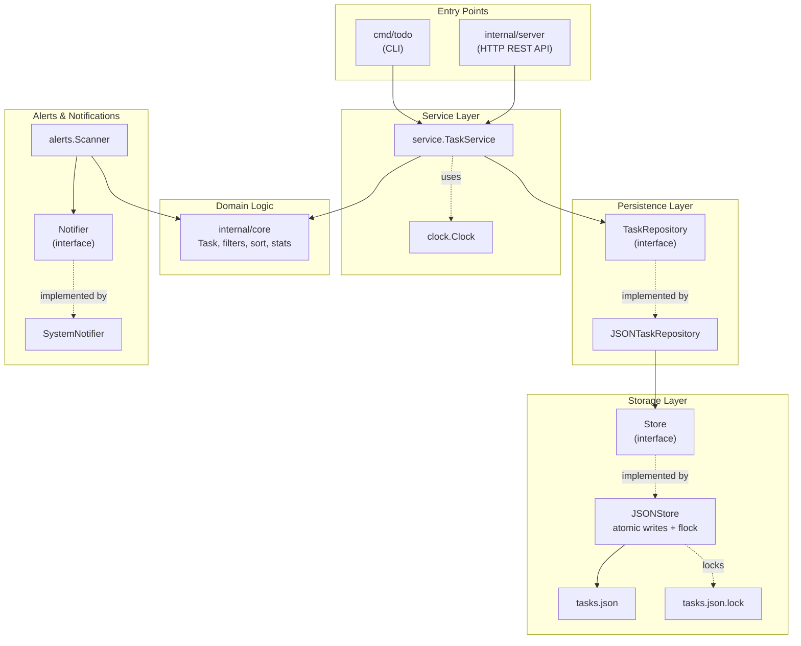
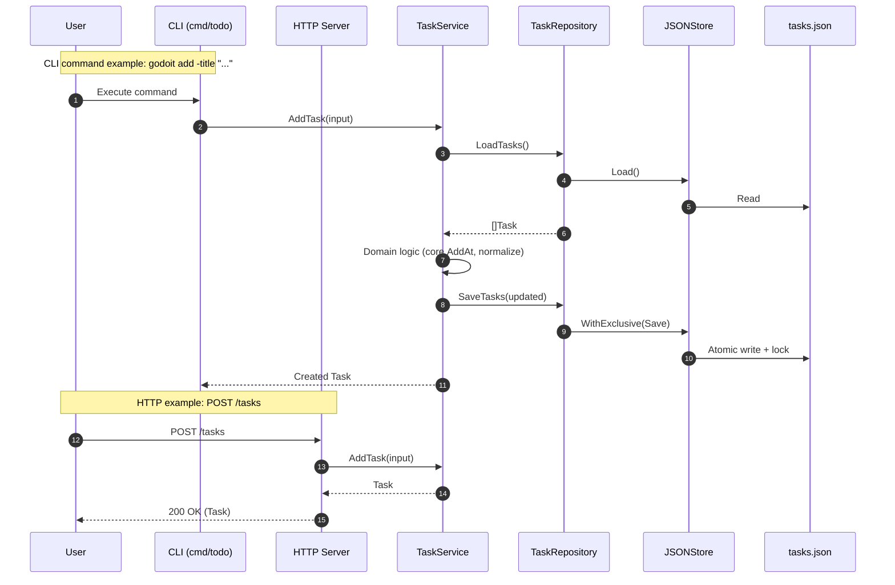

## Architecture

This document summarizes the system architecture, key components, and data flow of `godoit`.

### High-level component diagram

```
┌──────────────────────────────────────────────────────────────────────────┐
│                            ENTRY POINTS                                   │
├─────────────────────────────┬────────────────────────────────────────────┤
│   CLI (cmd/todo)            │   HTTP Server (internal/server)            │
│   • add, list, done         │   • GET/POST/PUT/DELETE /tasks             │
│   • edit, rm, alerts        │   • GET /stats                             │
│   • stats, server           │   • GET /health                            │
└──────────────┬──────────────┴────────────────┬───────────────────────────┘
               │                                │
               └────────────────┬───────────────┘
                                │
                                ▼
                ┌───────────────────────────────────────┐
                │   SERVICE LAYER                       │
                │   (internal/service)                  │
                │                                       │
                │   • TaskService                       │
                │     - AddTask, UpdateTask             │
                │     - MarkDone, QueryTasks            │
                │     - RemoveTask, GetTask             │
                │                                       │
                │   • Uses: clock.Clock (time inject)   │
                └─────┬──────────────────┬──────────────┘
                      │                  │
           ┌──────────▼─────────┐       │
           │   DOMAIN LOGIC     │       │
           │   (internal/core)  │       │
           │                    │       │
           │   • Task entity    │       │
           │   • Add, Update    │       │
           │   • MarkDone       │       │
           │   • Dependencies   │       │
           │   • Recurrence     │       │
           │   • Filters, Sort  │       │
           │   • Stats          │       │
           └────────────────────┘       │
                                        │
                          ┌─────────────▼─────────────────┐
                          │   PERSISTENCE LAYER           │
                          │   (internal/repository)       │
                          │                               │
                          │   TaskRepository (interface)  │
                          │         ▲                     │
                          │         │ implements          │
                          │   JSONTaskRepository          │
                          └──────────┬────────────────────┘
                                     │
                          ┌──────────▼─────────────────────┐
                          │   STORAGE LAYER                │
                          │   (internal/store)             │
                          │                                │
                          │   Store (interface)            │
                          │      ▲                         │
                          │      │ implements              │
                          │   JSONStore                    │
                          │   • Atomic writes              │
                          │   • File locking (flock)       │
                          └──────┬─────────────────────────┘
                                 │
                    ┌────────────┴────────────┐
                    ▼                         ▼
            ┌──────────────────┐     ┌──────────────────┐
            │  tasks.json      │     │ tasks.json.lock  │
            │  (JSON file)     │     │ (file lock)      │
            └──────────────────┘     └──────────────────┘


┌────────────────────────────────────────────────────────────────────┐
│   ALERTS & NOTIFICATIONS (internal/alerts, internal/notifications) │
├────────────────────────────────────────────────────────────────────┤
│   alerts.Scanner                                                   │
│   • Scan(tasks) → alerts (overdue, due soon, blocked)              │
│   • Watch mode (continuous monitoring)                             │
│   • Uses: notifications.Notifier (interface)                       │
│                                                                     │
│   notifications.SystemNotifier (implements Notifier)               │
│   • Linux: notify-send                                             │
│   • macOS: osascript                                               │
│   • Windows: PowerShell toasts                                     │
│   • Fallback: Console output                                       │
└────────────────────────────────────────────────────────────────────┘
```

<details>
<summary>Click to view interactive Mermaid diagram (requires Mermaid support)</summary>


</details>

### Request/command sequence (example)

**CLI Flow: `godoit add -title "..."`**

```
User → CLI (cmd/todo) → TaskService → TaskRepository → JSONStore → tasks.json
                              ↓
                         Domain Logic
                         (core.AddAt,
                          normalize)
                              ↓
     ← ← ← ← ← ← ← ← ← ← SaveTasks ← ← ← ← ← ← ← ← ← ← ← ← ← ←
                              ↓
                     WithExclusive(Save)
                              ↓
                    Atomic write + flock
                              ↓
                         tasks.json
```

**HTTP Flow: `POST /tasks`**

```
Client → HTTP Server → TaskService → TaskRepository → JSONStore → tasks.json
          (handler)        ↓
                      AddTask(input)
                           ↓
                    Domain + Persist
                           ↓
       ← ← ← ← ← ← ← Task object ← ← ← ← ← ← ← ← ← ← ← ← ← ← ←
          ↓
   200 OK (JSON)
```

**Detailed sequence:**

```
1. User executes: godoit add -title "Buy groceries" -p 2

2. CLI parses flags and calls:
   RunAdd(title, desc, due, repeat, priority, tags, after)

3. CLI creates TaskService:
   store := store.DefaultStore()
   repo := repository.NewJSONTaskRepository(store)
   svc := service.NewTaskService(repo, clock.SystemClock{})

4. TaskService.AddTask(ctx, AddTaskInput{...})
   ├─ repo.LoadTasks(ctx)
   │  ├─ store.Load() → []byte
   │  └─ json.Unmarshal() → []Task
   ├─ core.AddAt(tasks, title, due, now)
   ├─ Normalize priority, repeat, tags
   └─ repo.SaveTasks(ctx, updatedTasks)
      ├─ store.WithExclusive(ctx, fn)
      │  ├─ Acquire file lock (tasks.json.lock)
      │  ├─ json.Marshal(tasks) → []byte
      │  ├─ Write to temp file
      │  ├─ fsync()
      │  ├─ Atomic rename
      │  └─ Release lock
      └─ Return

5. CLI prints: "Added: Buy groceries (ID: 1)"
```

<details>
<summary>Click to view interactive Mermaid sequence diagram (requires Mermaid support)</summary>


</details>

### Components

- CLI (`cmd/todo`): Parses flags, orchestrates commands (`add`, `list`, `done`, `edit`, `rm`, `alerts`, `stats`, `server`). Wires `TaskService`, `Repository`, and `Store` for local operations.
- HTTP Server (`internal/server`): Exposes REST endpoints (`/tasks`, `/stats`, `/health`). Wires `TaskService` similarly to the CLI runtime.
- Service (`internal/service`): Business logic surface. Validates inputs, applies domain rules, delegates persistence to `TaskRepository`, and time to `clock.Clock`.
- Repository (`internal/repository`): Abstraction over persistence. `JSONTaskRepository` serializes tasks to/from JSON via `store.Store`.
- Store (`internal/store`): File-backed JSON storage (`JSONStore`) with atomic writes and cross-process file locking using `flock`.
- Domain (`internal/core`): Entities (`Task`), domain operations (add/update/done/recurrence/deps), sorting, filtering, and statistics.
- Alerts (`internal/alerts`): Scans tasks for overdue/due-soon/blocked; optional watch mode; uses `notifications.Notifier`.
- Notifications (`internal/notifications`): OS-specific desktop notifications with console fallback; `SystemNotifier`, `ConsoleNotifier`, `NoOpNotifier`.
- Clock (`internal/clock`): Time abstraction for deterministic testing (`Clock`, `SystemClock`).

### Data flow

1. Entry points (CLI or HTTP) call `TaskService` methods.
2. `TaskService` loads tasks through `TaskRepository`, performs domain operations (core), and persists via `TaskRepository`.
3. `TaskRepository` uses `store.Store` to read/write JSON; `JSONStore` performs atomic writes and file locking.
4. `alerts.Scanner` can scan tasks periodically and notify via `notifications.Notifier`.
5. The server aggregates statistics using `core.CalculateStats` and returns them via `/stats`.
